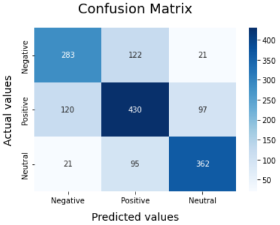

# Tweet Sentiment Extraction
## Data

In the data we have 3 files the first "test.csv" contains the tweet and the corresponding sentiment. In the second "train.csv", we are provided with a word or phrase from the tweet (selected_text) that encapsulates the sentiment provided.

### Files
    train.csv - the training set
    test.csv - the test set
    sample_submission.csv - a sample submission file in the correct format

#### Column
    textID - unique ID for each piece of text.
    text - the text of the tweet.
    sentiment - the general sentiment of the tweet.
    selected_text - [train only] the text that supports the tweet's sentiment.

## Linear SVM classifier

## Code
### Read data 
- Read 3 files : 

        train.csv   
        test.csv 
        sample_submission.csv 
- Keep only textID, text and sentiment.

### cleaning :
- The first step of ‘cleaning’ the data was to convert all letters to lowercase, then punctuation, numbers, HTML tags and URLs and usernames were removed from the Tweets.

- Stop-words were removed or not from the tweets using the ‘NLTK’ stop-words corpus.

### Vectorisation — TF/IDF

In order for the text to be read by the machine learning algorithm, we convert it into a number. For the needs of this change, different processes of "vectorization" have been implemented. In our program, we implement the vectorization by TF/TDF.

Term Frequency/Inverse Document Frequency (TF/IDF) :
The "term frequency" corresponds to the frequency of appearance of a certain word in the text, while the "inverse document frequency" consists in reducing the importance of the words that appear most often in the whole text.

### Model

Linear Support Vector Classification (SVC) is the model that we have chosen. SVC method applies a linear kernel function to perform classification and it performs well with a large number of samples.
- In the first step, we'll define the classifier by using the LinearSVC class.
- Then, we'll fit the model on train data and check the model accuracy score. 

## Evaluation

For the evaluation of the parameters we cited accuracy, precision, recall, F1 score and mean square error...etc.
We have used different models (citer les modèles) that give different results for each measure. In the end we have to choose measures that correctly meet the evaluation criteria.

### Observations

1. In the figure below, we have the results for the Support Vector Machine model. The overall accuracy of the model here is 69%. We have balanced values between the different sentiments (Negative, Positive and Neutral). The positive dominates the negative by 9% and the neutral by 10%. 

                           precision    recall    f1-score       support

           -1              0.67         0.66      0.67           426
            0              0.66         0.66      0.66           647
            1              0.75         0.76      0.76           478

        accuracy                                  0.69           1551
        macro avg          0.70         0.70      0.70           1551
        weighted avg       0.69         0.69      0.69           1551
    
2. From the confusion matrix shown we see the actual predicted values of the SVM model. The model clearly shows its best performance when classifying the positive class. 
430 correct predictions in this class against 283 for the negative class and 362 for the neutral class.

### Observations (removing stop word)
